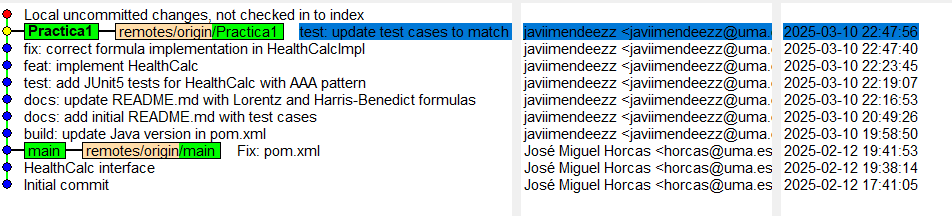

# HealthCalc - Calculadora de Salud 🏥

## Práctica 1

### Descripción General

HealthCalc es una calculadora de salud que permite estimar dos métricas clave para una persona:

1. **Peso Ideal (IW)**: La calculamos con la fórmula de **Lorentz** en función de la altura y el género.
2. **Tasa Metabólica Basal (BMR)**: La calculamos con la **ecuación de Harris-Benedict**, que estima el gasto energético diario en reposo.

Esta calculadora pretende ser utilizada como una herramienta auxiliar en la estimación de parámetros de salud de las personas.

### Fórmulas utilizadas

#### 1. Cálculo del Peso Ideal (Lorentz)

El peso ideal se calcula utilizando la **fórmula de Lorentz**:

**Para hombres:**  
`IW = altura - 100 - ((altura - 150) / 4)`

**Para mujeres:**  
`IW = altura - 100 - ((altura - 150) / 2.5)`

---

#### 2. Cálculo de la Tasa Metabólica Basal (TMB) - Harris-Benedict

Usamos la **ecuación de Harris-Benedict** para estimar el metabolismo basal:

**Para hombres:**  
`BMR = 88.362 + (13.397 * peso) + (4.799 * altura) - (5.677 * edad)`

**Para mujeres:**  
`BMR = 447.593 + (9.247 * peso) + (3.098 * altura) - (4.330 * edad)`

---

### Casos de prueba

A continuación, describo los casos de prueba diseñados para verificar el correcto funcionamiento de la clase `HealthCalcImpl`.

#### **1. Cálculo del Peso Ideal (`idealBodyWeight`)**
| Caso de prueba | Entrada | Salida esperada |
|---------------|---------|----------------|
| Hombre de 170 cm | `height = 170`, `gender = 'M'` | Peso ideal ≈ 65 kg |
| Mujer de 160 cm | `height = 160`, `gender = 'F'` | Peso ideal ≈ 56 kg |
| Altura mínima permitida | `height = 140`, `gender = 'M'` | Valor válido |
| Altura máxima permitida | `height = 220`, `gender = 'F'` | Valor válido |
| Altura inferior a la mínima permitida | `height = 100`, `gender = 'M'` | Excepción o mensaje de error |
| Altura superior a la máxima permitida | `height = 250`, `gender = 'F'` | Excepción o mensaje de error |
| Género no válido | `height = 180`, `gender = 'X'` | Excepción o mensaje de error |
| Formato incorrecto (altura no numérica) | `height = "abc"`, `gender = 'M'` | Excepción o mensaje de error |

---

#### **2. Cálculo de la Tasa Metabólica Basal (`basalMetabolicRate`)**
| Caso de prueba | Entrada | Salida esperada |
|---------------|---------|----------------|
| Hombre de 70kg, 175cm, 25 años | `weight = 70`, `height = 175`, `age = 25`, `gender = 'M'` | TMB ≈ 1724 kcal |
| Mujer de 60kg, 165cm, 30 años | `weight = 60`, `height = 165`, `age = 30`, `gender = 'F'` | TMB ≈ 1383 kcal |
| Peso límite inferior | `weight = 30`, `height = 160`, `age = 20`, `gender = 'M'` | Valor válido |
| Peso límite superior | `weight = 200`, `height = 190`, `age = 40`, `gender = 'F'` | Valor válido |
| Peso inferior al mínimo permitido | `weight = 10`, `height = 160`, `age = 20`, `gender = 'M'` | Excepción o mensaje de error |
| Peso superior al máximo permitido | `weight = 300`, `height = 190`, `age = 40`, `gender = 'F'` | Excepción o mensaje de error |
| Edad mínima permitida | `weight = 70`, `height = 175`, `age = 18`, `gender = 'M'` | Valor válido |
| Edad máxima permitida | `weight = 70`, `height = 175`, `age = 100`, `gender = 'M'` | Valor válido |
| Edad inferior a la mínima permitida | `weight = 70`, `height = 175`, `age = 10`, `gender = 'M'` | Excepción o mensaje de error |
| Edad superior a la máxima permitida | `weight = 70`, `height = 175`, `age = 120`, `gender = 'M'` | Excepción o mensaje de error |
| Género no válido | `weight = 70`, `height = 175`, `age = 25`, `gender = 'X'` | Excepción o mensaje de error |
| Formato incorrecto (peso no numérico) | `weight = "abcde"`, `height = 175`, `age = 25`, `gender = 'M'` | Excepción o mensaje de error |
| Formato incorrecto (edad no numérica)** | `weight = 70`, `height = 175`, `age = "xxxx"`, `gender = 'M'` | Excepción o mensaje de error |

---

### Captura de ejecución de tests en Maven
La siguiente imagen muestra la ejecución exitosa de todos los casos de prueba en Maven, confirmando que la implementación funciona correctamente.

---

### Captura de commits en `gitk`
Aquí presento una captura de `gitk`, donde podemos ver todos los commits realizados durante la **Práctica 1**, siguiendo la convención `Conventional Commits`.

---

## Práctica 2

### Diagramas de casos de uso

#### Diagrama de casos de uso básico

#### Diagrama de casos de uso extendido

### Especificación de un caso de uso

